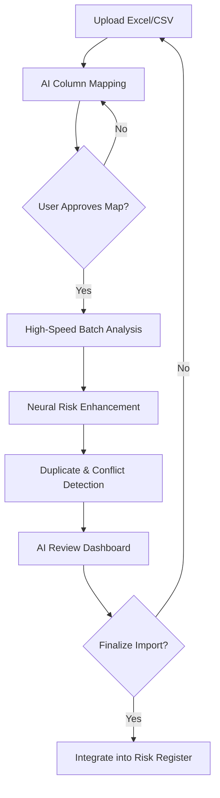
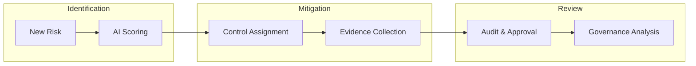

# Project Workflow: AI-Powered Risk Assessment

This document outlines the core workflows of the application, from initial data ingestion to long-term risk management and governance.

## 1. AI-Driven Risk Import Workflow
The primary entry point for large-scale data ingestion.

1.  **Ingestion**: User uploads a file with raw risk data.
2.  **AI Mapping**: The system predicts which columns match `Title`, `Description`, `Likelihood`, `Impact`, and `Department`.
3.  **Batch Analysis**: Risks are processed in parallel using LLMs (e.g., Gemini or OpenAI) to improve clear statements and suggest scores.
4.  **Verification**: Users review the "Original" vs "AI-Improved" data before final commit.

## 2. Risk Management Lifecycle
The daily operation for Risk Officers and Department Managers.

-   **Scoring**: Automatic calculation of `Inherent Risk Score` (Impact × Likelihood).
-   **Controls**: Mapping risks to specific mitigation controls (e.g., ISO 27001 or NIST frameworks).
-   **Evidence**: Uploading documents to prove control effectiveness.

## 3. Technical Architecture & Data Flow
The backbone of the "Vibe Coding" implementation.

-   **Frontend (React/TS)**: High-performance Glassmorphism UI using MUI and Framer Motion. Data fetching via standardized `api.ts` services.
-   **Backend (Express/TS)**: RESTful API for business logic, streaming AI analysis via SSE (Server-Sent Events).
-   **Database (PostgreSQL)**: Relational schema for risks, controls, and audit logs.
-   **AI Layer**: Pluggable AI service (`ai.service.ts`) supporting multiple LLM providers for real-time insights and high-speed batch processing.

## 4. Governance & Compliance
Ensuring data integrity and alignment.

-   **Audit Logs**: Every change is tracked in `risk_history`.
-   **Drift Analysis**: Periodic AI checks to see if the risk landscape has changed significantly from the baseline.
-   **Executive Reporting**: Dynamic PDF generation for board-level reviews.
